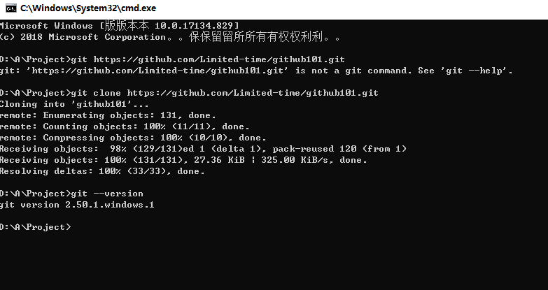

# Git工具安装与使用报告

## 学员GitHub用户名: Limited-time

## 1. Git安装过程

（在此处详细描述Git的安装过程，包括使用的操作系统、安装方法等）

1. 打开浏览器，访问 Git 官网（https://git-scm.com/），点击 “Download” 下载对应操作系统（Windows）的安装包。
2. 双击安装包，按默认选项一路点击 “Next” 完成安装。
3. 安装完成后，打开电脑的 “命令提示符”（Windows），输入命令：git --version

## 2. 遇到的问题及解决方法

Limited-time.assets文件夹上传不上来，于是图片渲染失败，而过程中GitHub仓修改和本地仓修改冲突

报错：
 error: Pulling is not possible because you have unmerged files 错误，核心是 Git 仓库里存在 “未完成合并” 的文件，这些文件卡住了合并 / 拉取流程，导致无法执行 git pull
 
方法：
 git merge --abort
 
 终止未完成的合并（清理异常状态，保留本地文件），执行这个命令，Git 会取消所有未完成的合并操作，完全保留你的图片、MD 文件等本地修改，只清理卡住的合并状态
 
 然后能正常拉取到本地：git pull origin main
 
 再从本地推送到GitHub：git push origin main
 
 期间学到了一个：
   暂存本地所有修改（保护图片不丢失）：git stash
   
   恢复本地修改（把图片 / MD 文件改回来）：git stash pop

以及GitHub图的URL：
    
用 GitHub 图片原始链接，100% 显示
如果改路径后仍不显示，大概率是图片没真的推到 GitHub，或缓存问题，用图片的 GitHub 原始链接最稳妥：

1、打开 GitHub 仓库，找到这个 PNG 文件（进入 lesson2 目录，能看到图片文件）；

2、点击图片文件，再点击右上角的「Raw」按钮（会打开纯图片页面）；

3、复制浏览器地址栏里的链接（比如https://raw.githubusercontent.com/Limited-time/github101/main/assignments/lesson2/image-20251207225727814-1765138698825.png）；

4、把 MD 里的图片代码换成这个链接

## 3. 版本信息截图

（在此处插入执行`git --version`命令后的截图）

## 4. Git命令使用过程总结

（在此处总结使用Git命令的过程，包括但不限于以下操作：
- git clone: 克隆远程仓库到本地
- git add: 添加文件到暂存区
- git commit: 提交更改到本地仓库
- git push: 推送更改到远程仓库
- git pull: 从远程仓库拉取最新更改
等其他相关命令的使用体验和理解）

---

## CI 自动评分与运行指引
- 课程作业检测仅在 PR 到 main 时执行，请通过 Pull Request 提交本文件。
- 文件命名：assignments/lesson2/{你的GitHub用户名}.md。
- 自动评分工作流： [.github/workflows/calculate-score.yml](../../.github/workflows/calculate-score.yml)。
- 首次 Fork 后：进入 Actions → 选择 “Calculate Student Score” → 点击 “Run workflow” 并选择 main → 在日志中查看成绩。
